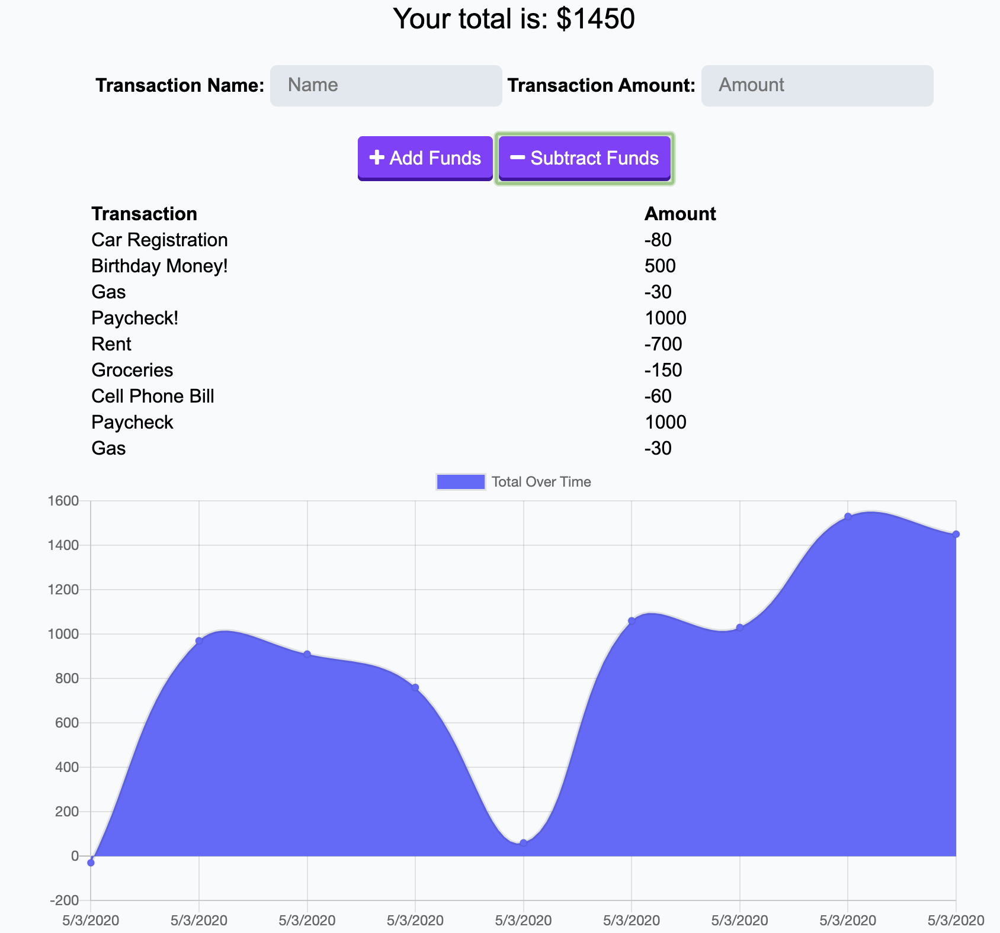

# Budget Tracker PWA

## Project Description
This is a budget tracking application that has been reconfigured to be a Progressive Web Application!

## How to Use
* ### Application Instructions:
    * With this budget tracker, you can keep track of the funds being added to your account and removed from your account. 
    * You will give each transaction a descriptive name and enter the amount.
    * You will then choose whether this amount is an income or an expense by clicking "+ Add Funds" or "- Subtract Funds".
    * Your data will be saved even when your device is not online. When the device finally reconnects, any pending transactions will be synced!

* ### PWA Instructions
    * Follow these instructions to download from your browser:
        1. Navigate to [https://secure-bayou-27137.herokuapp.com/](https://secure-bayou-27137.herokuapp.com/) 
        2. Click the plus (+) sign at the far right end of your browser's URL bar
        
    * Follow these instructions to install a PWA for your specific smartphone OS:

        * iOs:

            1. Navigate to [https://secure-bayou-27137.herokuapp.com/](https://secure-bayou-27137.herokuapp.com/) with Safari.

            2. Tap the Share button in Safari.

            3. Tap the icon labeled Add to Home Screen.

            4. Tap Add in the upper-right corner.

            5. Name your PWA, then tap Add in the upper-right corner.

        * Android:

            1. Navigate to [https://secure-bayou-27137.herokuapp.com/](https://secure-bayou-27137.herokuapp.com/) with Chrome.

            2. Tap the menu button in the upper right corner of Chrome.

            3. Tap the icon labeled Add to Home Screen.

            4. Name your PWA, then tap Add below the promp.

## Built With

* [Node.js](https://nodejs.org/en/)
* [MongoDB](https://www.mongodb.com/)
* [Express](https://www.npmjs.com/package/express)

## Preview

## Links
* Deployed App:
* GitHUb Repo:

## Got Questions? 
### Ask Me:
* GitHub Profile: https://github.com/lalliere
* My Email: emilylallier@yahoo.com 